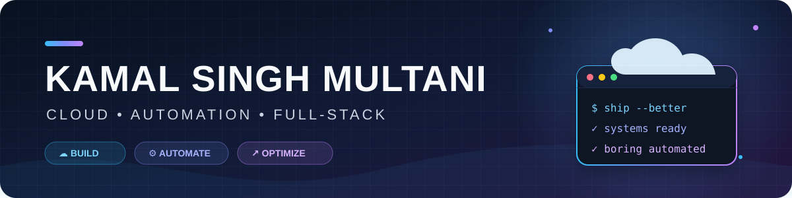

  

  
  

## Hello, world 👋

I'm **Kamal Singh Multani** — a builder working where **cloud, infrastructure, automation, and software** meet.

I enjoy turning messy operational data and repetitive work into systems that are clear, useful, and a little more enjoyable to use.

- ☁️ Building cloud cost, resource-tagging, and governance tools
- 🖥️ Practising Windows Server, Active Directory, DNS, replication, and Group Policy
- 🤖 Automating repeatable workflows with Python, PowerShell, and AI-assisted tooling
- 🧩 Creating full-stack applications with clean, practical user experiences
- 🎯 Interested in cloud, IT infrastructure, automation, and support engineering

## Toolbox

  
  
  
  
  
  
  
  
  
  
  
  
  

## Featured builds

<table>
  <tr>
    <td width="50%" valign="top">
      <h3>🧭 Active Directory Homelabs</h3>
      
Hands-on Windows Server labs covering AD DS, DNS, domain-controller lifecycle, multi-site replication, Group Policy, and troubleshooting.

      
<strong>Windows Server · AD DS · DNS · PowerShell</strong>

      <a href="https://github.com/KamalSinghMultani/Active-Directory-Homelabs">Explore the labs →</a>
    </td>
    <td width="50%" valign="top">
      <h3>☁️ Cloud Cost EDA</h3>
      
An interactive EC2 and S3 analysis dashboard with filtering, cost outlier detection, visual exploration, and machine-learning insights.

      
<strong>Python · Streamlit · Pandas · Plotly · scikit-learn</strong>

      <a href="https://github.com/KamalSinghMultani/cost-eda-app">Open the dashboard project →</a>
    </td>
  </tr>
  <tr>
    <td width="50%" valign="top">
      <h3>🤖 Codex Job Search</h3>
      
A local-first workflow that finds and ranks opportunities, prepares tailored application material, tracks outcomes, and supports interview prep.

      
<strong>Codex · Python · Automation · Data workflows</strong>

      <a href="https://github.com/KamalSinghMultani/codex-job-search">See the workflow →</a>
    </td>
    <td width="50%" valign="top">
      <h3>🚦 PRO Portal</h3>
      
A full-stack candidate-screening simulation with rule-based evaluation, flag review, overrides, and local persistence.

      
<strong>Node.js · Express · TypeScript · AngularJS</strong>

      <a href="https://github.com/KamalSinghMultani/PRO-portal">View the project →</a>
    </td>
  </tr>
</table>

## The creative side quest 🎮

I also built a **game-menu-inspired interactive portfolio** with a custom ink, bone, crimson, and acid-yellow design system, responsive artboards, and pointer-driven depth.

  

## How I like to work

  <strong>Think clearly</strong> &nbsp;•&nbsp; <strong>Build practically</strong> &nbsp;•&nbsp; <strong>Document the path</strong> &nbsp;•&nbsp; <strong>Automate the repeatable</strong>

---

  <strong>Build it. Measure it. Automate the boring part. ☁️</strong> 
  Thanks for stopping by — take a look around and follow the experiments.

